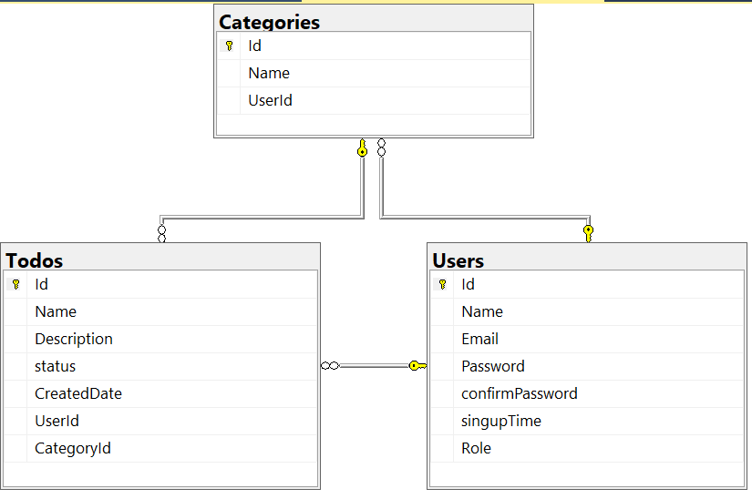

# Todo
### Features
- Login & sign in
- Authentication
- Authorization
- Initial page for Users who haven't logged in yet.
- Logout
- Todo page has all CRUD Operation
- Category Page has all CRUD Operation
- UserINSystem page for only Admin `can Update User Role & Delete User`
----
### Videos
<video src="TodoProject.mp4" controls></video>

---
### Database Scheme

### dotnet Version:
- dotnet version 6 or higher.
- Sql Server 2019

